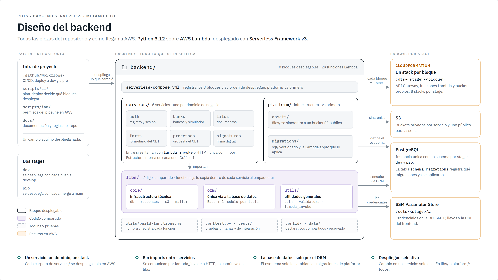
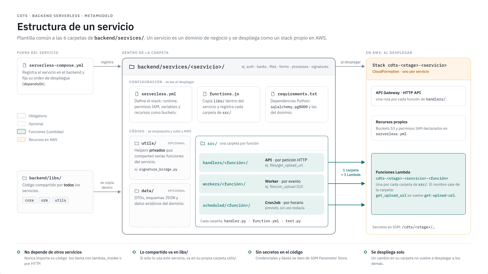

# Metamodelo estructural del backend CDTS

> Modelo de **cómo se compone** el proyecto: qué tipos de elementos existen, qué
> contiene cada uno, cómo se relacionan y qué reglas los gobiernan. **No** describe
> servicios concretos (`auth`, `signatures`...), sino la *plantilla* que todo
> servicio, Lambda o librería debe seguir.
>
> Fuentes: [`docs/repo-structure.md`](../repo-structure.md), `backend/serverless-compose.yml`,
> `backend/utils/build-functions.js`, `backend/libs/**`, `backend/conftest.py`,
> `scripts/ci/plan-deploy.sh` y el código real de `backend/services/**`.

## Gráficos

Cada gráfico es un lienzo HTML de 1600×900 (diagramas hechos con HTML/CSS y SVG, fuentes
incrustadas, sin imágenes). Se abre en cualquier navegador y se exporta a PNG y PDF para
el documento del entregable.

| # | Tema | Archivos | Estado |
|---|---|---|---|
| 0 | Diseño completo del backend | [HTML](./grafico-0-diseno.html) · [PNG](./grafico-0-diseno.png) · [PDF](./grafico-0-diseno.pdf) | listo |
| 1 | Estructura de un servicio | [HTML](./grafico-1-servicio.html) · [PNG](./grafico-1-servicio.png) · [PDF](./grafico-1-servicio.pdf) | listo |
| 2 | Estructura de una función (Lambda) | | pendiente |
| 3 | Código compartido `libs/` | | pendiente |
| 4 | Acceso a datos (ORM) | | pendiente |
| 5 | Pruebas | | pendiente |
| 6 | Bloques de plataforma | | pendiente |





Este documento es la referencia completa en texto: catálogo de elementos, relaciones,
reglas y diferencias entre la documentación y el código.

---

## 1. Vista general por niveles

```
Proyecto (repositorio)
├── Infra de proyecto ─────────── .github/workflows, scripts/ci, scripts/iam, docs, .cursor/rules
└── Backend (backend/) ────────── todo el runtime serverless
    ├── Composición ───────────── serverless-compose.yml  (registra bloques + dependsOn)
    ├── Bloque desplegable {abstracto}  = 1 stack CloudFormation
    │   ├── Servicio de dominio ─ services/<name>/   (un bounded context)
    │   └── Bloque de plataforma  platform/<name>/   (infra runtime transversal)
    │       Todo bloque contiene:
    │       ├── serverless.yml, functions.js, requirements.txt
    │       ├── utils/  (utils de servicio, privados)      0..1
    │       ├── data/   (DTOs, schemas, estáticos)         0..1
    │       └── src/<tipo>/<lambda>/                       0..*
    │           Lambda {abstracto}:  API | Worker | CronJob
    │           ├── handler.py      1
    │           ├── function.yml    1
    │           ├── test.py         1
    │           └── integration.py  0..1
    ├── Código compartido (libs/) ─ se copia dentro de cada bloque al empaquetar
    │   ├── core/   db, responses, logger, s3, mailer
    │   ├── orm/    Base + un Modelo por tabla  (capa de abstracción de BD)
    │   └── utils/  auth, passwords, validators, lambda_invoke  (utils generales)
    ├── Tooling ────────────────── utils/build-functions.js
    ├── Testing transversal ────── conftest.py, pytest.ini, tests/ (+ integration_helpers.py)
    └── Config / Data globales ─── config/, data/   (declarativos, reservados)
```

---

## 2. Catálogo de elementos

### 2.1 Proyecto y raíz

| Elemento | Ubicación | Mult. | Responsabilidad |
|---|---|---|---|
| **Proyecto** | repo | 1 | Contenedor de todo. La raíz es "agnóstica": solo infra de proyecto. |
| **Infra de proyecto** | `.github/workflows/`, `scripts/ci/`, `scripts/iam/`, `docs/`, `.cursor/rules/` | 1 | CI/CD, planificador de deploy selectivo, IAM bootstrap, documentación, reglas IA. Un cambio aquí produce **0 deploys**. |
| **Backend** | `backend/` | 1 | Todo lo que corre en AWS Lambda y todo lo necesario para empaquetarlo y probarlo. |

### 2.2 Composición y bloques desplegables

| Elemento | Ubicación | Mult. | Responsabilidad |
|---|---|---|---|
| **Composición** | `backend/serverless-compose.yml` | 1 | Registra cada bloque (`path`) y su orden (`dependsOn`). Todos los servicios dependen de `migrations`. |
| **Bloque desplegable** *(abstracto)* | carpeta directa de `services/` o `platform/` | 1..* | Unidad de despliegue independiente = **un stack CloudFormation** `cdts-<stage>-<bloque>`. Es descubierto automáticamente por `plan-deploy.sh`. |
| **Servicio de dominio** | `backend/services/<name>/` | 1..* | Representa **un solo dominio de negocio** (bounded context). Se empaqueta con el pipeline `validate → test → deploy → integration`. |
| **Bloque de plataforma** | `backend/platform/<name>/` | 0..* | Infra runtime transversal (migraciones, assets). Puede tocar varios dominios; esa es su razón de existir. Se despliega **antes** que los servicios y fuerza redeploy de todos. |
| **Carpeta de contenido** | `platform/<name>/<dir>/` (ej. `sql/`, `files/`) | 0..1 por bloque de plataforma | Datos autocontenidos del bloque: migraciones `.sql` versionadas, archivos a sincronizar a S3. |
| **Archivo de contenido** *(abstracto)* | dentro de la carpeta de contenido | 0..* | Cambiarlo despliega el bloque de plataforma (y, por la regla cardinal, todos los servicios). |
| **Migración SQL** | `platform/migrations/sql/YYYYMMDDHHMMSS_desc.sql` | 0..* | Secciones `-- +migrate up` (obligatoria) y `-- +migrate down`. Nunca califica schema. Estado en tabla `schema_migrations`. |
| **Asset estático** | `platform/assets/files/**` | 0..* | Se sincroniza a un bucket S3 público; la BD guarda la *key*, no la URL. |

### 2.3 Archivos de un bloque

| Elemento | Mult. | Responsabilidad |
|---|---|---|
| **`serverless.yml`** | 1 | `provider` (runtime, stage, `stackName`, memoria/timeout por defecto, CORS global, `environment` con rutas SSM, IAM), `plugins`, `package.patterns` (excluye `test.py`/`integration.py`), `resources` (buckets, permisos) y `functions: ${file(./functions.js):build}`. |
| **`functions.js`** | 1 | Dos trabajos: (1) **copia `backend/libs/` dentro del bloque** (`./libs/`, gitignored) para que viaje en el zip; (2) delega el registro de Lambdas a `build-functions.js`. |
| **`requirements.txt`** | 1 | Dependencias Python del bloque (SQLAlchemy, pg8000, y las propias del dominio). |
| **Utils de servicio** — `utils/` | 0..1 | Helpers **privados del bloque**: lógica reutilizable por varias Lambdas del mismo dominio (ej. puentes hacia otro servicio, render de PDFs, decoradores propios de autorización). Se importan como `from utils.x import y`. |
| **Data de servicio** — `data/` | 0..1 | Modelos/DTOs, JSON schemas, datos estáticos del dominio. (Hoy ningún servicio lo usa; es parte de la plantilla.) |
| **`src/`** | 1 | Contiene las Lambdas, agrupadas por tipo en `handlers/`, `workers/`, `scheduled/`. |

### 2.4 Lambda y sus tres tipos

> **Precisión importante:** el tipo (API / Worker / CronJob) es de **cada Lambda**,
> no del servicio. Un mismo servicio puede tener Lambdas de los tres tipos (ej. `files`
> tiene 2 API y 1 Worker). El tipo lo fija **la subcarpeta** donde vive la Lambda.

| Elemento | Carpeta | Trigger | Responsabilidad |
|---|---|---|---|
| **Lambda** *(abstracto)* | `src/<tipo>/<carpeta_snake_case>/` | — | Una carpeta = una función AWS Lambda. Atributos derivados: `nombreAWS`, `handlerPath`. |
| **Lambda API** | `src/handlers/` | **API Gateway HTTP API** (`- httpApi:` en `function.yml`) | Endpoint REST consumido por el frontend u otro servicio. |
| **Lambda Worker** | `src/workers/` | **Evento asíncrono**: S3, SQS, SNS, Streams, invoke async | Procesamiento en segundo plano disparado por un evento. |
| **Lambda CronJob** | `src/scheduled/` | **EventBridge schedule** (`rate(...)` / `cron(...)`) | Tareas periódicas (ej. limpiar OTPs vencidos). Hoy sin instancias; parte de la plantilla. |

### 2.5 Archivos de una Lambda (estructura fija)

| Archivo | Mult. | Contrato |
|---|---|---|
| **`handler.py`** | 1 | Define `def handler(event, context)`. Las Lambdas HTTP se decoran con `@handle_exceptions` (y opcionalmente `@require_auth` o un decorador del servicio). Solo lógica de orquestación: valida entrada, llama ORM/utils, responde con `generate_response`. |
| **`function.yml`** | 1 | Configuración **específica** de la función: `description`, `events`, `timeout`, `memorySize`, `environment`. **No** lleva `name` ni `handler` (se autogeneran). |
| **`test.py`** | 1 | Pruebas unitarias colocalizadas, **≥ 3 casos**: happy path, validación de entrada (400), falla de dominio. Todo mockeado (`monkeypatch`), sin AWS ni BD. Carga el handler con la fixture `load_handler(__file__)`. **Bloquea el deploy** si falla. |
| **`integration.py`** | 0..1 | Pruebas en vivo contra la infra real de **dev** después del deploy: request HTTP real + verificación en Postgres/S3. `@pytest.mark.integration`, solo con `--integration`. **No bloquea** (continue-on-error). Se agrega en Lambdas con efectos persistentes o flujos async. |
| Archivos auxiliares | 0..* | Si una Lambda necesita más archivos, viven **dentro de su carpeta**. |

> **Precisión:** `integration.py` no es "por servicio importante" sino **por Lambda,
> opcional**. Hoy 15 de 29 Lambdas lo tienen (todo `signatures`, las que crean o
> modifican datos en `auth` y `files`).

### 2.6 Código compartido — `backend/libs/` (utils a nivel general)

Único lugar para código usado por **más de un bloque**. No se publica como Lambda
Layer: `functions.js` lo **copia** dentro de cada bloque al empaquetar, así que en
runtime se importa igual en todas partes (`from libs.core.db import db_session`).

| Paquete | Módulo | Qué expone |
|---|---|---|
| **`libs/core`** — infraestructura técnica | `db.py` | Lee credenciales de SSM (`/cdts/<stage>/db`), crea el `engine` SQLAlchemy (pg8000), fija `search_path` al schema del stage y expone el singleton **`db_session`** (`DBSession`: commit / rollback / close). |
| | `responses.py` | `generate_response(body, status)`, excepción de negocio **`HandledError(message, status)`** y el decorador **`@handle_exceptions`**: commit si todo OK, rollback + respuesta 4xx si `HandledError`, rollback + 500 opaco si otra excepción, y **siempre** cierra la sesión. |
| | `logger.py` | `Logger.log(level, msg)`. |
| | `s3.py` | `presign_upload`, `presign_download`, `upload_from_bytes`, `download_bytes`, `head_object`. |
| | `mailer.py` | `send_email(to, subject, html)` por SMTP (credenciales en SSM). Nunca lanza excepción. |
| **`libs/orm`** — capa de abstracción de BD | `base.py` | `Base` (`DeclarativeBase` + `to_dict()`). |
| | `<tabla>.py` | **Un modelo por tabla** (`Users`, `Banks`, `BankRates`, `BearerTokens`, `Forms`, `Processes`, `Files`, `Signatures`). |
| | `__init__.py` | Importa **todos** los modelos para que SQLAlchemy resuelva las FKs cruzadas. |
| **`libs/utils`** — utilidades generales | `auth.py` | `issue_token`, `verify_token`, decorador **`@require_auth`** (inyecta `event["user"]`). |
| | `passwords.py` | `hash_password` / `verify_password` (bcrypt). Separado de `auth.py` para que solo `auth` cargue la dependencia nativa. |
| | `validators.py` | `valid_email`, `password_reason`. |
| | `lambda_invoke.py` | `invoke_sync`, `invoke_async`, `resolve_function_name(service, fn)` → `cdts-<stage>-<service>-<fn-kebab>`. Vehículo oficial de comunicación entre Lambdas. |

### 2.7 La capa ORM en detalle

Patrón **Active Record** sobre SQLAlchemy 2.0:

```
Base (DeclarativeBase)
  + to_dict(): dict
      △
      │  (uno por tabla)
ModeloORM «tabla»
  + __tablename__
  + columnas Mapped[...]
  + public_dict(): dict                 ← serialización segura (oculta campos sensibles)
  + get_by_id(id)            «classmethod»
  + get_by_<campo>(valor)    «classmethod»
  + list_by_<campo>(valor)   «classmethod»
  + create(**campos)         «classmethod»   ← add + flush, sin commit
  + <transición>()           (ej. advance_to, mark_signed_at)
      │ usa
      ▼
db_session (DBSession singleton, libs/core/db.py) ──► PostgreSQL (schema dev | pro)
```

Reglas de la capa:

- Los handlers **nunca** escriben SQL: consultan y modifican solo a través de los
  métodos del modelo (verificado: ningún `handler.py` usa `text()`/`execute()`).
- Los modelos **no hacen commit**: hacen `flush`. El commit/rollback lo decide
  `@handle_exceptions` (unidad de trabajo = una invocación).
- El **esquema** lo define la Migración SQL; el modelo ORM lo **refleja**. Primero se
  escribe la migración, luego se ajusta el modelo.
- Credenciales siempre desde SSM; el `search_path` apunta al schema del stage, por eso
  ni los modelos ni las migraciones califican schema.

### 2.8 Los niveles de "utils"

| Nivel | Ubicación | Alcance | Puede importar |
|---|---|---|---|
| **Local de Lambda** | archivos auxiliares dentro de `src/<tipo>/<lambda>/` | Solo esa Lambda | `libs/*`, `utils/` de su bloque |
| **Utils de servicio** | `services/<name>/utils/` (o `platform/<name>/utils/`) | Todas las Lambdas de **ese** bloque | `libs/*` |
| **Utils generales (runtime)** | `backend/libs/utils/` (+ `libs/core`) | **Todos** los bloques | Solo `libs/*` (nunca `services/` ni `platform/`) |
| **Tooling de build** | `backend/utils/build-functions.js` | Empaquetado (Node, no runtime) | — |

Regla de ubicación: si lo usa **un** bloque → `services/<name>/utils/`; si lo usan
**dos o más** → `backend/libs/`, aunque eso implique redeploy total.

### 2.9 Tooling y testing transversal

| Elemento | Ubicación | Responsabilidad |
|---|---|---|
| **Generador de funciones** | `backend/utils/build-functions.js` | Escanea `src/{handlers,scheduled,workers}/*/function.yml`, valida `snake_case`, deriva `name` y `handler`, y hace merge con el `function.yml`. |
| **`conftest.py`** | `backend/conftest.py` | Stub de `boto3`, variables de entorno de prueba, flag `--integration`, fixture **`load_handler`** (importa el `handler.py` hermano con nombre único y enlaza los `utils/` del bloque correcto). |
| **`pytest.ini`** | `backend/pytest.ini` | Descubre `test.py`, `integration.py` y `test_*.py`; `--import-mode=importlib`. |
| **Tests transversales** | `backend/tests/` | Tests que no pertenecen a una Lambda (parser de migraciones, generador, utils de servicio) + **`integration_helpers.py`** (`api_base`, `query_one`, `create_test_user_directly`, `cleanup_*`...). |
| **Config / Data globales** | `backend/config/`, `backend/data/` | Declarativos compartidos (catálogos, semillas). Sin lógica. Hoy reservados. |

### 2.10 Recursos de runtime (AWS) que el modelo referencia

| Recurso | Relación con el modelo |
|---|---|
| **API Gateway HTTP API** | Uno por Servicio; trigger de las Lambda API. CORS global en `provider.httpApi`. |
| **Evento asíncrono** (S3 / SQS / SNS / invoke) | Trigger de las Lambda Worker. |
| **EventBridge schedule** | Trigger de las Lambda CronJob. |
| **PostgreSQL** | Instancia única, schemas `dev` y `pro`. Accedida solo vía `libs/core/db` + ORM. Esquema definido por las Migraciones SQL. |
| **SSM Parameter Store** | `/cdts/<stage>/...`: credenciales de BD, SMTP, URL del frontend, llaves. Nada de secretos en código o env vars. |
| **S3 Bucket** | Declarado en el `serverless.yml` del bloque dueño (`resources`). Acceso vía `libs/core/s3`. |

---

## 3. Relaciones

| # | Origen | Relación UML | Destino | Mult. | Significado |
|---|---|---|---|---|---|
| 1 | Proyecto | composición ◆ | Infra de proyecto, Backend | 1 / 1 | El repo se divide en infra de proyecto y runtime. |
| 2 | Backend | composición ◆ | Composición, Código compartido, Tooling, Testing, Config/Data | 1 c/u | Piezas globales del backend. |
| 3 | Composición | agregación ◇ | Bloque desplegable | 1..* | Registra los bloques; `dependsOn` entre bloques (asociación reflexiva). |
| 4 | Servicio de dominio, Bloque de plataforma | generalización △ | Bloque desplegable | — | Mismos archivos y reglas; difieren solo en intención. |
| 5 | Bloque desplegable | composición ◆ | `serverless.yml`, `functions.js`, `requirements.txt` | 1 c/u | Archivos obligatorios del bloque. |
| 6 | Bloque desplegable | composición ◆ | Utils de servicio, Data de servicio | 0..1 c/u | Carpetas opcionales privadas. |
| 7 | Bloque desplegable | composición ◆ | Lambda | 0..* | Las Lambdas viven en `src/`. |
| 8 | Bloque de plataforma | composición ◆ | Carpeta de contenido | 0..1 | `sql/`, `files/`. |
| 9 | Carpeta de contenido | composición ◆ | Archivo de contenido | 0..* | Migración SQL y Asset estático son sus dos especializaciones (△). |
| 10 | Lambda API / Worker / CronJob | generalización △ | Lambda | — | El tipo lo define la subcarpeta. |
| 11 | Lambda | composición ◆ | `handler.py`, `function.yml`, `test.py` | 1 c/u | Estructura fija. |
| 12 | Lambda | composición ◆ | `integration.py` | 0..1 | Opcional. |
| 13 | Lambda API | asociación «disparada por» | HTTP API event | 1..* | `- httpApi:` en `function.yml`. |
| 14 | Lambda Worker | asociación «disparada por» | Evento asíncrono | 1..* | S3 / SQS / SNS / invoke. |
| 15 | Lambda CronJob | asociación «disparada por» | Schedule | 1..* | `rate()` / `cron()`. |
| 16 | `functions.js` | dependencia «usa» | Generador (`build-functions.js`) | 1 | Delegación del registro de Lambdas. |
| 17 | `functions.js` | dependencia «copia» | Código compartido (`libs/`) | 1 | Mirror de `libs/` dentro del bloque en el empaquetado. |
| 18 | `handler.py` | dependencia «importa» | `libs/core` (`@handle_exceptions`, `generate_response`) | 1 | Contrato de respuesta y transacción. |
| 19 | `handler.py` | dependencia «accede a datos vía» | ModeloORM | 0..* | Única puerta a la BD. |
| 20 | `handler.py` | dependencia «importa» | Utils de servicio, `libs/utils` | 0..* | Reutilización de lógica. |
| 21 | Utils de servicio | dependencia «importa» | `libs/*` | 0..* | Nunca al revés. |
| 22 | ModeloORM | generalización △ | `Base` | — | Un modelo por tabla. |
| 23 | ModeloORM | dependencia «usa» | `db_session` (`libs/core/db`) | 1 | Sesión compartida por invocación. |
| 24 | `libs/core/db` | dependencia | PostgreSQL, SSM | 1 / 1 | Conexión + credenciales. |
| 25 | Migración SQL | dependencia «define esquema de» | PostgreSQL | 1 | El modelo ORM refleja ese esquema. |
| 26 | `test.py` | dependencia «usa» | `conftest.py` (`load_handler`) | 1 | Carga aislada del handler. |
| 27 | `integration.py` | dependencia «usa» | `integration_helpers.py` | 1 | Acceso a API/BD/S3 reales de dev. |
| 28 | Servicio de dominio | asociación reflexiva «invoca» | Servicio de dominio | 0..* | **Sin import**: `lambda_invoke` (sync/async), webhook HTTP o presigned URL. |

---

## 4. Reglas / restricciones

| Id | Regla | Dónde se hace cumplir |
|---|---|---|
| **R1** | Un Servicio **nunca importa** código de otro Servicio. Se comunican por `lambda_invoke` (sync/async), webhook HTTP o presigned URL. | Review (§12 de `repo-structure.md`) |
| **R2** | Ningún Servicio importa código de `platform/`. | Review |
| **R3** | `libs/` no importa nada de `services/` ni `platform/`. | Review |
| **R4** | Lo usado por **un** bloque va en su `utils/`; lo usado por **≥ 2** va en `libs/`. Prohibido `common/`, `shared/`, `helpers/` dentro de `src/`. | Review |
| **R5** | **Una carpeta = una Lambda.** El tipo lo define la subcarpeta: nada de HTTP en `workers/` ni cron en `handlers/`. | Review |
| **R6** | Carpeta de Lambda en `snake_case`. `name` y `handler` **no** se escriben: se derivan. | `build-functions.js` (falla el package) |
| **R7** | Toda Lambda tiene `test.py` con ≥ 3 casos (happy path, 400, falla de dominio), sin AWS ni BD reales. | Job `test` del pipeline (bloquea deploy) |
| **R8** | `integration.py` es **block-local** (no llama APIs de otro bloque), solo corre en **dev**, datos con prefijo `itest-` y limpieza en `finally`. | `conftest.py` + pipeline |
| **R9** | Acceso a BD **solo** vía ORM; transacción gestionada por `@handle_exceptions`. | Convención + review |
| **R10** | Credenciales **solo** en SSM (`/cdts/<stage>/...`), nunca en código ni env vars. | Review + IAM |
| **R11** | Las migraciones **nunca** califican schema, ni hacen `SET search_path` ni `CREATE/DROP SCHEMA`. Un `.sql` mergeado no se edita. | `scripts/ci/lint-migrations.py` |
| **R12** | Solo existen dos stages: `dev` y `pro`. | Review |
| **R13** | HTTP API v2 (`- httpApi:`), CORS una sola vez en `provider.httpApi`. | Review |
| **R14** | `test.py` e `integration.py` se excluyen del zip (`package.patterns`). | `serverless.yml` |

### Atributos derivados (convención de nombres)

| Atributo | Regla | Ejemplo |
|---|---|---|
| `Bloque.stackName` | `cdts-<stage>-<bloque>` | `cdts-dev-files` |
| `Lambda.nombreAWS` | `cdts-<stage>-<servicio>-<carpeta con _ → ->` | `cdts-pro-files-get-upload-url` |
| `Lambda.handlerPath` | `src/<tipo>/<carpeta>/handler.handler` | `src/workers/on_upload/handler.handler` |
| Parámetros SSM | `/cdts/<stage>/<área>/<clave>` | `/cdts/dev/db/host` |

---

## 5. Validación contra el código actual

El metamodelo cubre el 100 % de lo que existe hoy:

| Tipo de elemento | Instancias hoy |
|---|---|
| Servicio de dominio | 6 |
| Bloque de plataforma | 2 (`migrations` con `sql/`, `assets` con `files/`) |
| Lambda API | 28 (27 en servicios + `migrations/apply`) |
| Lambda Worker | 1 |
| Lambda CronJob | 0 |
| `handler.py` / `function.yml` / `test.py` | 29 / 29 / 29 |
| `integration.py` | 15 |
| Utils de servicio | 3 (`processes`, `signatures`, `migrations`) |
| Modelos ORM | 8 |

---

## 6. Discrepancias entre la documentación y el código

El modelo sigue **el código real**. Conviene alinear la doc (o decidir lo contrario):

1. **`layers/shared/` no existe.** `repo-structure.md` dice que lo compartido se
   publica como Lambda Layer desde `backend/layers/shared/`. En la práctica el código
   compartido vive en **`backend/libs/`** y `functions.js` lo **copia** a cada bloque.
2. **`backend/utils/` no contiene utils Python.** La doc lo describe como "utilidades
   genéricas cross-domain"; en realidad solo tiene `build-functions.js` (tooling). Las
   utils generales de runtime están en `backend/libs/utils/`.
3. **`serverless-compose.yml` de ejemplo** en la doc muestra `shared-layer`; el real usa
   `migrations` como dependencia común.
4. **Dos Lambdas sin trigger HTTP viven en `handlers/`:** `signatures/sign` (invocada con
   `invoke_async`) y `migrations/apply` (invocada por el pipeline). Por la regla R5
   serían `workers/`. Se pueden mover o documentar como excepción.

---

## 7. Qué queda fuera de este modelo

- **Servicios concretos** y sus endpoints (no es un modelo de servicios).
- **Pipeline CI/CD** (plan → validate → infrastructure → services → summary) y reglas de
  deploy selectivo.
- **Despliegue en AWS** (cómo quedan los stacks, buckets, BD y frontend en la nube).

Esos dos últimos son candidatos naturales para el segundo gráfico del entregable.
